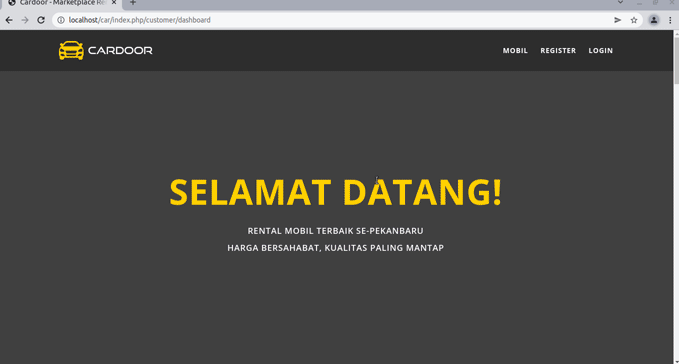

<h2 align="center">Aplikasi Rental Mobil (CodeIgniter 3)</h2>

Aplikasi marketplace rental mobil menggunakan framework CodeIgniter 3. Dengan multi user (admin, pemilik rental dan kustomer).

---

<h4 align="center">Daftar Nama Kelompok 1</h4>

1. Yusuf Abdul Wahid (12210477)
2. Setia Novie Nuradi (12210478)
3. Fathur Rahman Duta Pratama ( 12210350 )
4. Paisal Rohman (12210202)

---

#### Screenshot aplikasi (dalam GIF)

##### Kustomer

  

##### Pemilik Rental

  

##### Admin

  

---

#### Built With

- [PHP Framework CodeIgniter 3 ](https://codeigniter.com/ "PHP Framework CodeIgniter 3 ")
- [MySQL Database](https://www.mysql.com/ "MySQL Database")
- [Cardoor HTML Template (Frontend)](https://bootstrap4.com/cardoor-car-rental-html-template/ "Cardoor HTML Template (Frontend)")
- [Stisla Admin Template](https://getstisla.com/ "Stisla Admin Template")

---

#### Instalasi

Download/clone repository, kemudian import database **rental-mobil.sql**, selesai

---

#### Pembagian Tugas

### Yusuf & Wais

- Edit" (tampilan, teks) halaman customer agar beda dengan aslinya, pastikan semua fungsi berjalan baik

### Setia & Fathur

- Pastikan semua fungsi pada halaman admin berjalan dengan baik dan lakukan perubahan pada setiap menu (tampilan, letak tabel dll)

## Perhatikan

- fungsi upload file, cetak, dan menampilkan gambar
- data transaksi (perhitungan otomatis dll) tidak ada yang salah
